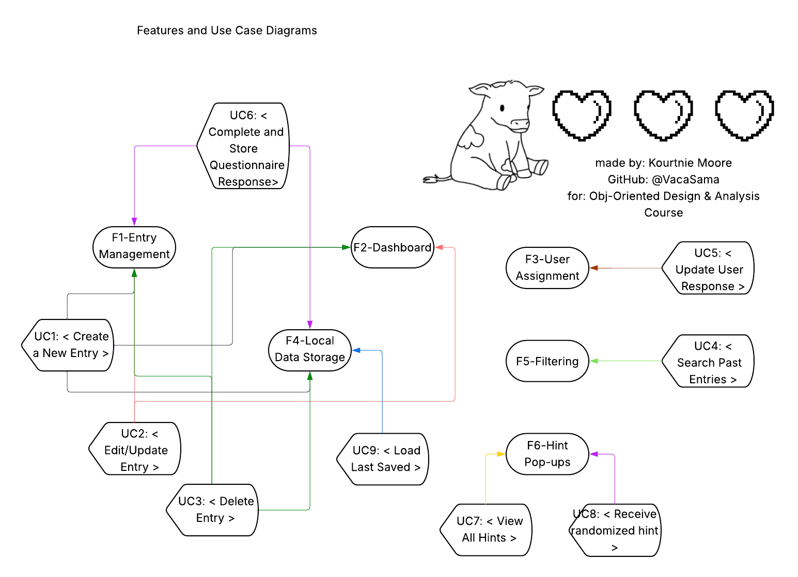

features-and-usecases markdown

# Features

## *F1-Entry Management

-Summary: User logs an entry, and the application stores it.

## *F2-Dashboard

-Summary: Allows the user to view and access their own
individual dashboard (entries, notes, code snippets, and error descriptions).

## *F3-User Assignment

-Summary: Gives the user privacy by only allowing the
user to access their own personal entries.

## *F4-Local Data Storage

-Summary: Tracks if the user has already been to the application, 
if they have completed questionnaires, and keeps track of what
user entries have been made per individual.

## *F5-Filtering

-Summary: Allows the user to search through entries via 
Title or keywords.

## *F6-Hint Pop-ups

-Summary: Using a toast object and button to allow the user to
see a "quick hint", otherwise viewable through the hints tab.

---
### Brief Use Cases

UC1: < Create a New Entry >

Primary Actor: User, Dev

Goal: Allow the user to create a new entry 
for their Dungbeetle Journal and view it on their dashboard.

UC2: < Edit/Update Entry >

Primary Actor: User 

Goal: On button-click, the user can edit their entry. 
Sometimes the user may have notes they would like to alter 
or alter their code-snippet to something that works and why.

UC3: < Delete Entry >

Primary Actor: User, Dev

Goal: Allows the user to delete their selected entry, 
which causes a permanent deletion.

UC4: < Search Past Entries >

Primary Actor: User 

Goal: Allows the user to search through their entries via 
entry title or keywords.

UC5: < Update User Response >

Primary Actor: User, Dev

Goal: Allows the user to update their answers to their 
questionnaire, and if the user is unable to, then the Dev 
will step in. 

UC6: < Complete and Store Questionnaire Response>

Primary Actor: User, Dev

Goal: The user will complete the questionnaire, and the Dev 
will ensure that the questionnaire response has been 
inserted into the database successfully. 

UC7: < View All Hints >

Primary Actor: User 

Goal: The user can view all hints in Hints Tab versus 
receiving a randomized hint from the dashboard Hint Button. 

UC8: < Receive randomized hint >

Primary Actor: User 

Goal: On the dashboard, there is a button titled "Show Hint" 
that allows the user to receive a random hint. 

UC9: < Load Last Saved >

Primary Actor: User

Goal: Load all of the users' saved data, 
so that they can pick up where they left off.

---

## Use Case Traceability Table

| Use Cases | Features 
|---------|--------|
| UC1: < Create a New Entry >  | F1, F2, F4 |
| UC2: < Edit/Update Entry > | F1, F2, F4 |
| UC3: < Delete Entry > | F1, F2, F4 |
| UC4: < Search Past Entries > | F1, F2, F4, F5 |
| UC5: < Update User Response > | F2, F3, F4 |
| UC6: < Complete and Store Questionnaire Response> | F1, F4 |
| UC7: < View All Hints > | F5, F6 |
| UC8: < Receive randomized hint >| F2, F6 |
| UC9: < Load Last Saved >| F4 |

---

## Features and Use Case Diagram

**This diagram shows the relationships between
features and use cases*

---