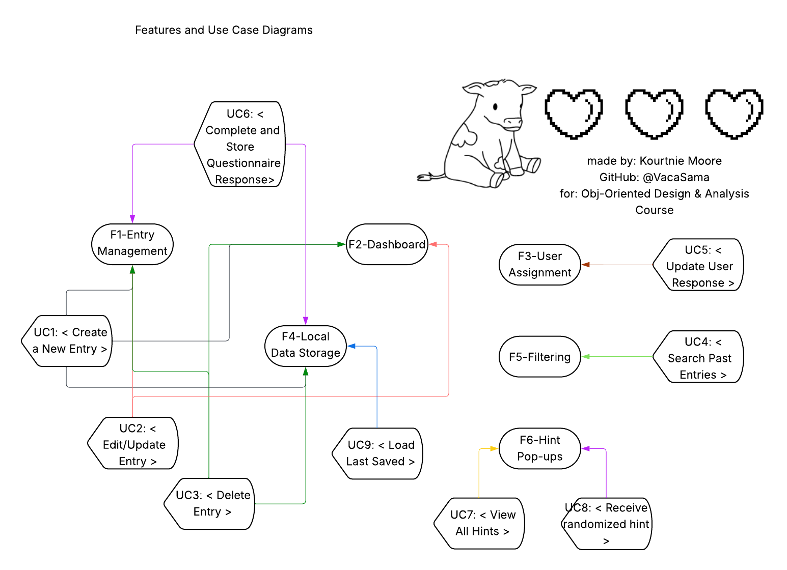

features-and-usecases markdown file

# Features

## *F1-Entry Management

-Summary: User logs an entry, and the application stores it.

## *F2-Dashboard

-Summary: Allows the user to view and access their own
individual dashboard (entries, notes, code snippets, and error descriptions).

## *F3-User Assignment

-Summary: Gives the user privacy by only allowing the
user to access their own personal entries.

## *F4-Local Data Storage

-Summary: Tracks if the user has already been to the application, 
if they have completed questionnaires, and keeps track of what
user entries have been made per individual.

## *F5-Filtering

-Summary: Allows the user to search through entries via 
Title or keywords.

## *F6-Hint Pop-ups

-Summary: Using a toast object and button to allow the user to
see a "quick hint", otherwise viewable through the hints tab.

---
### Brief Use Cases

UC1: < Create a New Entry >

Primary Actor: User, Dev

Goal: Allow the user to create a new entry 
for their Dungbeetle Journal and view it on their dashboard.

UC2: < Edit/Update Entry >

Primary Actor: User 

Goal: On button-click, the user can edit their entry. 
Sometimes the user may have notes they would like to alter 
or alter their code-snippet to something that works and why.

UC3: < Delete Entry >

Primary Actor: User, Dev

Goal: Allows the user to delete their selected entry, 
which causes a permanent deletion.

UC4: < Search Past Entries >

Primary Actor: User 

Goal: Allows the user to search through their entries via 
entry title or keywords.

UC5: < Update User Response >

Primary Actor: User, Dev

Goal: Allows the user to update their answers to their 
questionnaire, and if the user is unable to, then the Dev 
will step in. 

UC6: < Complete and Store Questionnaire Response>

Primary Actor: User, Dev

Goal: The user will complete the questionnaire, and the Dev 
will ensure that the questionnaire response has been 
inserted into the database successfully. 

UC7: < View All Hints >

Primary Actor: User 

Goal: The user can view all hints in Hints Tab versus 
receiving a randomized hint from the dashboard Hint Button. 

UC8: < Receive randomized hint >

Primary Actor: User 

Goal: On the dashboard, there is a button titled "Show Hint" 
that allows the user to receive a random hint. 

UC9: < Load Last Saved >

Primary Actor: User

Goal: Load all of the users' saved data, 
so that they can pick up where they left off.

---

## Use Case Traceability Table

| Use Cases | Features 
|---------|--------|
| UC1: < Create a New Entry >  | F1, F2, F4 |
| UC2: < Edit/Update Entry > | F1, F2, F4 |
| UC3: < Delete Entry > | F1, F2, F4 |
| UC4: < Search Past Entries > | F1, F2, F4, F5 |
| UC5: < Update User Response > | F2, F3, F4 |
| UC6: < Complete and Store Questionnaire Response > | F1, F4 |
| UC7: < View All Hints > | F5, F6 |
| UC8: < Receive randomized hint >| F2, F6 |
| UC9: < Load Last Saved >| F4 |

---

## Features and Use Case Diagram

**This diagram shows the relationships between
features and use cases*

---

## Detailed Use Cases

---

### UC1: < Create a New Entry >
**Primary Actor:**  USER, DEV

**Goal:**  Allow the user to create a new journal entry that will be stored 
	and displayed on the user's dashboard.

**Preconditions:**  The entry creation form/modal is available and active.

**Success Outcome:**  
- A new entry is successfully stored in the system.
- The entry appears on the user's dashboard.

** Main Flow **
1. The user clicks the "Add New Entry" button on the dashboard.
2. The system displays the entry creation form/modal.
3. The user enters the required information (title, notes, code snippet, error description, etc.).
4. The user clicks ""ADD"".
5. The system validates the input fields.
6. The system stores the entry in local storage or the database.
7. The system refreshes the dashboard.
8. The new entry appears in the user's entry list.

** Alternate Flow **
- A1: Missing Required Fields

If required fields are empty, the system displays a validation message.
The entry is not saved until the fields are completed.

- A2: Storage Failure

If the system cannot store the entry, an error message is displayed.
The user is prompted to try again.

---

** Implementation Evidence **
- Entry point: https://github.com/VacaSama/ProjectDungbeetle/blob/a62bb80e9a927eb129dbe93454b69a236635435b/Controllers/HomeController.cs#L49
- Key collaborators (if applicable): https://github.com/VacaSama/ProjectDungbeetle/blob/a62bb80e9a927eb129dbe93454b69a236635435b/Models/Entry.cs
									 https://github.com/VacaSama/ProjectDungbeetle/blob/a62bb80e9a927eb129dbe93454b69a236635435b/Views/Home/Index.cshtml#L81

** Unit Test Evidence **
- Test file: (permalink)
- Covers success path: AddEntry() https://github.com/VacaSama/ProjectDungbeetle/blob/a62bb80e9a927eb129dbe93454b69a236635435b/Controllers/HomeController.cs#L49
- Covers alternate/failure path: (If/Else Statement No direct "Method") https://github.com/VacaSama/ProjectDungbeetle/blob/a62bb80e9a927eb129dbe93454b69a236635435b/Views/Home/Index.cshtml#L173

---

### UC2: < Edit/Update Entry >
**Primary Actor:**  USER

**Goal:**  Allows the user to edit an existing entry 

**Preconditions:**  An entry must already exist for the user to edit.

**Success Outcome:**  The selected entry is updated and the changes are saved.

** Main Flow **
1. The user navigates to the dashboard.
2. The user selects an existing entry.
3. The user clicks the ""Edit/Update"" button.
4. The system displays the pre-filled, editable entry form.
5. The user updates the desired fields.
6. The user clicks ""Save Changes"".
7. The system validates the updated data.
8. The system updates the stored entry.
9. The dashboard displays the updated entry and updates timestamp.

** Alternate Flow **
- A1: Entry Not Found

If the selected entry cannot be located, the system displays an error message.

- A2: Invalid Update Data

If validation fails, the system prompts the user to correct the data.

---

** Implementation Evidence **
- Entry point: https://github.com/VacaSama/ProjectDungbeetle/blob/a62bb80e9a927eb129dbe93454b69a236635435b/Controllers/HomeController.cs#L78
- Key collaborators (if applicable): https://github.com/VacaSama/ProjectDungbeetle/blob/a62bb80e9a927eb129dbe93454b69a236635435b/Models/Entry.cs
									 https://github.com/VacaSama/ProjectDungbeetle/blob/a62bb80e9a927eb129dbe93454b69a236635435b/Views/Home/Index.cshtml#L159

** Unit Test Evidence **
- Test file: (permalink)
- Covers success path: UpdateEntry() https://github.com/VacaSama/ProjectDungbeetle/blob/a62bb80e9a927eb129dbe93454b69a236635435b/Controllers/HomeController.cs#L78
- Covers alternate/failure path: UpdateEntry() https://github.com/VacaSama/ProjectDungbeetle/blob/a62bb80e9a927eb129dbe93454b69a236635435b/Controllers/HomeController.cs#L86

---

### UC3: < Delete Entry >
**Primary Actor:**  USER, DEV

**Goal:**  Allows the user to delete an existing entry 
**Preconditions:**  
- An entry must already exist for the user to delete them.
- The use must confirm the deletion action to prevent accidental deletions. 
- 
**Success Outcome:**  The user will receive a confirmation prompt upon confirming the deletion.
Then permanently deletes the entry from the system and removes it from the dashboard.

** Main Flow **
1. The user navigates to the dashboard.
2. The user selects an entry.
3. The user clicks the Delete button.
4. The system prompts the user to confirm the deletion.
5. The user confirms the action.
6. The system removes the entry from storage.
7. The dashboard refreshes and the entry is no longer visible.

** Alternate Flow **
- A1: ...
- A2: ...

---

** Implementation Evidence **
- Entry point: https://github.com/VacaSama/ProjectDungbeetle/blob/a62bb80e9a927eb129dbe93454b69a236635435b/Controllers/HomeController.cs#L111
- Key collaborators (if applicable):https://github.com/VacaSama/ProjectDungbeetle/blob/a62bb80e9a927eb129dbe93454b69a236635435b/Models/Entry.cs
									 https://github.com/VacaSama/ProjectDungbeetle/blob/a62bb80e9a927eb129dbe93454b69a236635435b/Views/Home/Index.cshtml#L161

** Unit Test Evidence **
- Test file: (permalink)
- Covers success path: DeleteEntry() https://github.com/VacaSama/ProjectDungbeetle/blob/a62bb80e9a927eb129dbe93454b69a236635435b/Controllers/HomeController.cs#L111
- Covers alternate/failure path: DeleteEntry() https://github.com/VacaSama/ProjectDungbeetle/blob/a62bb80e9a927eb129dbe93454b69a236635435b/Controllers/HomeController.cs#L115

---

### UC4: < Search Past Entries >
**Primary Actor:**  USER

**Goal:**  Allows the user to search through their past entries using keywords (within notes or error description)
or title names.

**Preconditions:**  
- Journal entries must exist for the user to search through.
- All required entry fields (title, notes, code snippet, error description) must have value information in them
in order for the search function to work effectively.

**Success Outcome:**  The entry or entries most matching the search
criteria will be displayed at the top of the entry list on the dashboard.
Following, any others that match the search criteria, from: perfect match (if any) to least matching.

** Main Flow **
1. The user enters a keyword or title in the search bar.
2. The user submits the search query.
3. The system scans stored entries.
4. The system filters entries based on the search keyword.
5. Matching entries are displayed on the dashboard.

** Alternate Flow **
- A1: No Matching Results

If no entries match the search query, the system displays 
a message indicating no results were found.

- A2: Empty Search Query
If the search query is empty, the system ignores the search, refreshes and display all 
entries in order of most recent to least recent.

---

** Implementation Evidence **
- Entry point: https://github.com/VacaSama/ProjectDungbeetle/blob/a62bb80e9a927eb129dbe93454b69a236635435b/Controllers/HomeController.cs#L137
- Key collaborators (if applicable): https://github.com/VacaSama/ProjectDungbeetle/blob/a62bb80e9a927eb129dbe93454b69a236635435b/Models/Entry.cs
									 https://github.com/VacaSama/ProjectDungbeetle/blob/a62bb80e9a927eb129dbe93454b69a236635435b/Views/Shared/_Layout.cshtml#L46

** Unit Test Evidence **
- Test file: (permalink)
- Covers success path: SortSearch() https://github.com/VacaSama/ProjectDungbeetle/blob/a62bb80e9a927eb129dbe93454b69a236635435b/Controllers/HomeController.cs#L137
- Covers alternate/failure path: SortSearch() https://github.com/VacaSama/ProjectDungbeetle/blob/a62bb80e9a927eb129dbe93454b69a236635435b/Controllers/HomeController.cs#L160

---

### UC5: < Update User Response >
**Primary Actor:**  USER, DEV

**Goal:**  Allows the user to update their answers for the questionnaire, if there were
any changes in goals, experience level, name or other. 

**Preconditions:**  The user must first, complete the questionnaire in order
to update their responses. Otherwise, the display will remain disabled. 

**Success Outcome:**  The user sucessfully updates their questionnaire responses.

** Main Flow **
1. The user navigates to the User Profile.
2. The user selects the option to ""update"" responses to enable changes.
3. The system displays the previous responses.
4. The user modifies one or more answers.
5. The user submits the updated responses, by clicking ""save changes"".
6. The system validates and saves the updates

** Alternate Flow **
- A1: Update Not Allowed

If the user cannot update responses, 
the developer or administrator must assist with updating the stored data.

---

** Implementation Evidence **
- Entry point: https://github.com/VacaSama/ProjectDungbeetle/blob/a62bb80e9a927eb129dbe93454b69a236635435b/Controllers/UserProfileController.cs
- Key collaborators (if applicable): (permalink)

** Unit Test Evidence **
- Test file: 
- Covers success path: (If/Else Statement No direct "Method", JS ID used) https://github.com/VacaSama/ProjectDungbeetle/blob/a62bb80e9a927eb129dbe93454b69a236635435b/wwwroot/js/dashboard.js#L44
									  https://github.com/VacaSama/ProjectDungbeetle/blob/a62bb80e9a927eb129dbe93454b69a236635435b/wwwroot/js/dashboard.js#L37
                                      https://github.com/VacaSama/ProjectDungbeetle/blob/a62bb80e9a927eb129dbe93454b69a236635435b/Views/UserProfile/Index.cshtml#L74
- Covers alternate/failure path: testMethodName (optional permalink to lines)

---

### UC6: < Complete and Store Questionnaire Response >
**Primary Actor:**  USER, DEV

**Goal:**  Complete the questionnaire, then, send and store the user's responses
in the database and the User Profile. 

**Preconditions:**  The user is accessing the application for the first time
or has not completed the questionnaire.

**Success Outcome:**  The questionnaire responses are stored in the system
and sent to display on the user's profile. 

** Main Flow **
The system prompts the user with the questionnaire.

The user answers each question.

The user submits the questionnaire.

The system validates the responses.

The system stores the responses in the database or local storage.

** Alternate Flow **
- A1: Incomplete Questionnaire

If some of the questions are not answered, the system prompts the user to complete them before submission.

- A2: Skip Questionnaire

If the user chooses to skip the questionnaire, it temporarily disables the questionnaire
modal until the user refreshes the page. 

- A3: Developer Reset
If the DEV, completes the questionnaire for testing purposes, they can reset
the cache ot local storage to allow them to appear as a new user and complete
the questionnaire again if changes have been made to it. 

---

** Implementation Evidence **
- Entry point: https://github.com/VacaSama/ProjectDungbeetle/blob/a62bb80e9a927eb129dbe93454b69a236635435b/Controllers/HomeController.cs#L27
- Key collaborators (if applicable): https://github.com/VacaSama/ProjectDungbeetle/blob/a62bb80e9a927eb129dbe93454b69a236635435b/Controllers/UserProfileController.cs#L40
									 https://github.com/VacaSama/ProjectDungbeetle/blob/a62bb80e9a927eb129dbe93454b69a236635435b/Views/Home/Index.cshtml#L13
									 https://github.com/VacaSama/ProjectDungbeetle/blob/a62bb80e9a927eb129dbe93454b69a236635435b/Views/UserProfile/Index.cshtml#L55
									 
** Unit Test Evidence **
- Test file: (permalink)
- Covers success path: saveProfile() https://github.com/VacaSama/ProjectDungbeetle/blob/a62bb80e9a927eb129dbe93454b69a236635435b/wwwroot/js/dashboard.js#L66
- Covers alternate/failure path: closeModal() https://github.com/VacaSama/ProjectDungbeetle/blob/a62bb80e9a927eb129dbe93454b69a236635435b/wwwroot/js/dashboard.js#L61
	                             resetQuest() https://github.com/VacaSama/ProjectDungbeetle/blob/a62bb80e9a927eb129dbe93454b69a236635435b/wwwroot/js/dashboard.js#L73

---

### UC7: < View All Hints >
**Primary Actor:** USER, DEV

**Goal:**  Allows the user to view all hints in the Hints Tab, 
which is on the dashboard connected to the general notes, 
and contains all hints that are available to the user.

**Preconditions:**  There must be hints available in the system for the user to view. 

**Success Outcome:**  The user can view all hints in the Hints Tab.

** Main Flow **
1. The user navigates to the Hints tab.

2. The system retrieves all stored hints.

3. The system displays the list of hints to the user.

** Alternate Flow **
- A1: No Hints Available

If no hints exist, the system 
displays a message indicating that no hints are currently available.

---

** Implementation Evidence **
- Entry point: https://github.com/VacaSama/ProjectDungbeetle/blob/a62bb80e9a927eb129dbe93454b69a236635435b/Controllers/HomeController.cs#L27
- Key collaborators (if applicable): https://github.com/VacaSama/ProjectDungbeetle/blob/a62bb80e9a927eb129dbe93454b69a236635435b/Views/Home/Index.cshtml#L181

** Unit Test Evidence **
- Test file: (permalink)
- Covers success path: Index() https://github.com/VacaSama/ProjectDungbeetle/blob/a62bb80e9a927eb129dbe93454b69a236635435b/Controllers/HomeController.cs#L27
- Covers alternate/failure path: (If/Else Statement No direct "Method") https://github.com/VacaSama/ProjectDungbeetle/blob/a62bb80e9a927eb129dbe93454b69a236635435b/Views/Home/Index.cshtml#L216

---

### UC8: < Receive Randomized Hint >
**Primary Actor:**  USER

**Goal:**  Upon clicking the "Show Hint" button on the dashboard,
the user receives a random hint from the system, which is displayed 
in a pop-up or toast notification.

**Preconditions:**  Hints must be available in the system
for the user to receive a random hint.

**Success Outcome:**  A toast pop-up will display a random hint to the user.

** Main Flow **
1. The user clicks the Show Hint button.
2. The system selects a random hint from the hint collection.
3. The system displays the hint using a toast notification or popup.

** Alternate Flow **
- A1: No Hints Available

If no hints exist, the system displays
a message indicating that hints cannot be displayed.

---

** Implementation Evidence **
- Entry point: https://github.com/VacaSama/ProjectDungbeetle/blob/a62bb80e9a927eb129dbe93454b69a236635435b/Controllers/HomeController.cs#L27
- Key collaborators (if applicable): https://github.com/VacaSama/ProjectDungbeetle/blob/a62bb80e9a927eb129dbe93454b69a236635435b/Views/Home/Index.cshtml#L69
                                     https://github.com/VacaSama/ProjectDungbeetle/blob/a62bb80e9a927eb129dbe93454b69a236635435b/wwwroot/js/dashboard.js#L7

** Unit Test Evidence **
- Test file: (permalink)
- Covers success path: Index() https://github.com/VacaSama/ProjectDungbeetle/blob/a62bb80e9a927eb129dbe93454b69a236635435b/Controllers/HomeController.cs#L27
                               https://github.com/VacaSama/ProjectDungbeetle/blob/a62bb80e9a927eb129dbe93454b69a236635435b/wwwroot/js/dashboard.js#L15
- Covers alternate/failure path: (No direct "Method"))

---

### UC9: < Load Last Saved >
**Primary Actor:**  USER

**Goal:**  Load previously stored user data so
the user can continue where they left off.

**Preconditions:**  The user has previously stored data in local storage.

**Success Outcome:**  The user's entries, settings, 
and User Profile(basic user information and questionnaire response) are 
oaded successfully.

** Main Flow **
1. The user opens the application.
2. The system checks for stored user data.
3. The system retrieves the saved data.
4. The system loads the dashboard with the user's entries. 
5. The system loads the user's profile with their information and questionnaire responses.

** Alternate Flow **
- A1: No Saved Data

If no data exists, the system loads a default dashboard
and prompts the user to create their first entry.

---

** Implementation Evidence **
- Entry point: https://github.com/VacaSama/ProjectDungbeetle/blob/a62bb80e9a927eb129dbe93454b69a236635435b/Controllers/HomeController.cs
- Key collaborators (if applicable): https://github.com/VacaSama/ProjectDungbeetle/blob/a62bb80e9a927eb129dbe93454b69a236635435b/Views/UserProfile/Index.cshtml

** Unit Test Evidence **
- Test file: (permalink)
- Covers success path: DungbeetleDbContext() https://github.com/VacaSama/ProjectDungbeetle/blob/a62bb80e9a927eb129dbe93454b69a236635435b/Data/DungbeetleDbContext.cs#L6
									Initialize() https://github.com/VacaSama/ProjectDungbeetle/blob/a62bb80e9a927eb129dbe93454b69a236635435b/Data/SeedData.cs#L15
- Covers alternate/failure path: (No direct "Method"))

---